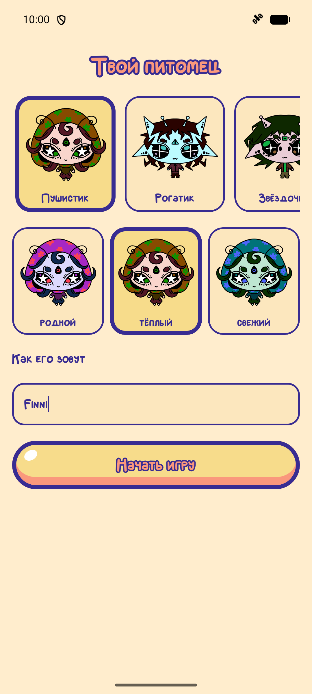
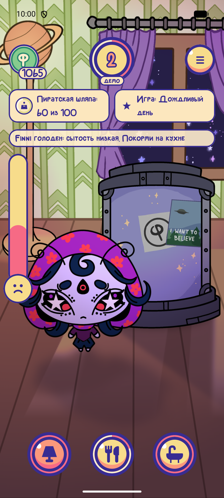
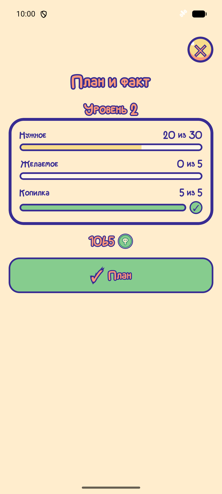
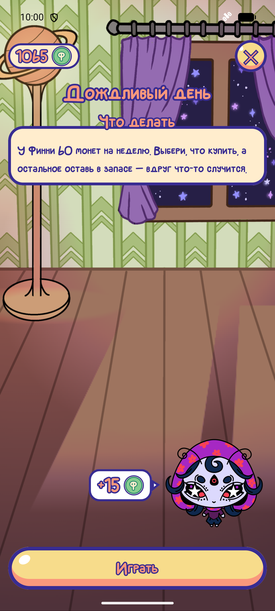

# Питомец Финни


Виртуальный питомец, на котором дети 7–11 лет учатся обращаться с деньгами: планировать
бюджет, отличать нужное от желаемого и копить на цель.

Ребёнок получает игровой доход, распределяет его между обязательными тратами, желаниями и
копилкой — и сразу видит последствия. Накормленный и чистый питомец радуется, забытый
грустит. Ошибка ничего не обнуляет: она объясняется и остаётся уроком, а не наказанием.

Приложение для Android, работает офлайн. Сделано для хакатона «Лидеры цифровой
трансформации» 2026, техническое задание — [docs/manual.pdf](docs/manual.pdf).

> Вся валюта в игре условная. Реальные деньги, платежи, реклама и сбор персональных данных
> детей в приложении не используются (ТЗ п. 2.7, 3.5).

## Попробовать за пять минут

1. Скачать `finney-0.10.0.apk` из [Releases](https://github.com/vsvsokol/finny/releases) (тег `v0.10.0`)
   на телефон с Android 8.0+ и установить — разрешить установку из этого источника.
2. На первом экране выбрать **«Режим проверки (демо)»**: все мини-игры открыты, для уровня хватает
   одного условия из трёх, сон короткий — пять уровней проходятся за несколько минут.
3. Дальше ведёт сама игра: рука показывает, куда нажать, — план, кухня и ванная, игра уровня,
   копилка, «Завершить уровень».
4. Сброс — меню главного → «Настройки» → раздел взрослого (пример на умножение) →
   «Начать игру заново» или «Удалить профиль».

Обязательный сценарий ТЗ по шагам — [Приложение А](docs/requirements-matrix.md#приложение-а-обязательный-демонстрационный-сценарий).

## Как устроена игра

Игра идёт **уровнями** — это игровой период ТЗ, он не привязан к календарю и закрывается кнопкой.

```
   начало уровня          план                    решения                  итоги
 ──────────────────────────────────────────────────────────────────────────────────────
   доход пришёл,     →   доход на нужное,   →   покупки, мини-игры,  →   условия уровня
   шкалы питомца         хочется и копилку       взносы в копилку         звёздами, план
   снизились                                                              и факт банками
```

Покупки и копилка открываются только после плана: сначала план, потом траты.

**Питомец** — четыре шкалы от 0 до 100: сытость, чистота, настроение и бодрость. За уровень они
снижаются, а еда, мытьё, игрушки и сон их восстанавливают. Питомец не болеет и не умирает:
в худшем случае он грустит, и экран говорит, как ему помочь.

**Уровень пройден**, если выиграна игра уровня и выполнено два условия из трёх: нужное обеспечено,
план выдержан, копилка пополнена. Не вышло — уровень играется заново, доход всё равно приходит.
Уровень **никогда не уменьшается**. Уровней 30, стадий роста шесть (с уровней 1, 2, 4, 6, 12, 20),
на экране три облика: питомец заметно подрастает на 2-м и на 6-м уровне. Доход растёт со стадией —
от 50 до 70 монет.

**Баланс не хранится отдельным числом.** Он всегда пересчитывается из истории операций,
поэтому не может разойтись с лентой, которую видит ребёнок. Уйти в минус невозможно:
операция, которая нарушила бы это, просто не записывается, а отказ объясняет, сколько не хватает
и что сделать.

Полные правила и формулы — [docs/economy.md](docs/economy.md).

## Что умеет приложение

| Раздел | Что внутри |
|---|---|
| **Питомец** | пять персонажей × три цвета тела (15 вариантов) и своё игровое имя; четыре шкалы; растёт с уровнем — три облика; шляпы и очки из гардероба |
| **Комната** | главный экран — комната питомца: кухня (кормить), ванная (мыть), зал с игрушками и капсулой для сна. Покупка — действие: еду бросают в рот, мыло трут, монеты списываются, когда это случилось |
| **Подсказки** | на первых уровнях рука показывает следующий шаг прямо внутри плана, кухни, ванной и копилки; «Как играть» — в меню в любой момент |
| **План бюджета** | доход делится на нужное, хочется и копилку кнопками «−/+», круг плана меняется с каждым нажатием; «Как в прошлый раз» — одной кнопкой. «План и факт» — три банки: черта — сколько задумал, заливка — сколько вышло, перебор — розовым и «!» |
| **Магазин** | 12 товаров: 4 нужных (яблоко, суп, мыло, полотенце) и 8 «хочется» (конфета, мультик, шесть игрушек). До покупки видны цена, категория и что изменится; при нехватке — «Не хватает N» и что сделать |
| **Копилка и цели** | шесть целей от 90 до 170 монет — три шляпы и трое очков: их нельзя купить, только накопить. Срок — по среднему взносу, монеты летят из кошелька в копилку, снятие — с подтверждением. Собранная вещь уходит в гардероб |
| **Мини-игры** | восемь игр по трём темам ТЗ — бюджет, сбережения, платежи и покупки: «Конвейер», «Список покупок», «Дорога к цели», «Дождливый день», «Лимонадная лавка», «Касса Финни», «Проверь чек», «Подработка». На уровне три игры: обязательная и две по желанию. У каждой игры три варианта сложности, они открываются до 25-го уровня; числа в каждой попытке новые |
| **Панель уровня** | чек-лист условий; чего не хватает — кнопкой, которая ведёт туда; «Итоги уровня» — звёзды за выполненные условия, план и факт, совет на следующий уровень |
| **Сон** | бодрость падает, питомец спит в капсуле от 4 до 30 минут — дольше на старших стадиях; облачко над спящим загадывает слово из справочника |
| **История и справочник** | лента операций: откуда пришли и куда ушли монеты; справочник терминов с картинками — в меню |
| **Раздел взрослого** | за барьером-примером: чему учит игра, пройденные темы, общий прогресс, бонус от взрослого, сброс и удаление профиля |
| **Настройки** | звук, музыка, анимации и вибрация выключаются по отдельности; напоминания; демо-режим |

Игра не наказывает за ошибку: за неудачную попытку мини-игры награда тоже начисляется,
а объяснение показывается при любом исходе.

Учебный контент лежит в JSON (`app/src/main/assets/content/`) и меняется без правок кода —
описание заданий в [docs/content-tasks.md](docs/content-tasks.md).

## Ключевые экраны

| Создание питомца | Главный | План и факт | Мини-игра |
|---|---|---|---|
|  |  |  |  |

Снято на эмуляторе API 37 (1080×2400) 26.09; с тех пор экраны доработаны по плейтестам. Все
скриншоты и черновик карточки RuStore — [docs/rustore/](docs/rustore/card.md).

## Статус

Сдача на ЛЦТ-2026 — **29 сентября 2026**, версия **0.10.0**.

| | |
|---|---|
| Сборка для сдачи | 0.10.0 — подписанный APK в [Releases](https://github.com/vsvsokol/finny/releases), тег `v0.10.0` |
| Требования ТЗ | 101 из 102 строк матрицы реализовано, 1 в работе — п. 3.6 «понятно без инструкции»: проверяется только на детях, их у нас пока не было — [docs/requirements-matrix.md](docs/requirements-matrix.md), там же план до финала |
| Сценарий Приложения А | все 12 шагов: эмулятор API 37 (26.09) и Galaxy S23 с релизного APK, офлайн (29.09); холодный запуск 1,9 с |
| Автотесты | 222 unit-теста и 14 инструментальных тестов базы, CI на каждый PR в `Main` |
| Пояснительная записка (ТЗ п. 5) | [docs/documentation.md](docs/documentation.md), PDF — [docs/documentation.pdf](docs/documentation.pdf) |
| Вопросы к заказчику | [docs/questions.md](docs/questions.md) |
| История разработки | [CHANGELOG.md](CHANGELOG.md) |

Серверная часть не используется: основной игровой цикл работает офлайн (ТЗ п. 3.1).

## Стек

| Слой | Технология |
|---|---|
| Язык | Kotlin |
| UI | Jetpack Compose + Material 3 |
| Навигация | Navigation Compose, типобезопасные маршруты |
| Зависимости | ручной контейнер `AppContainer`, без Hilt |
| Хранение | Room (SQLite), схема в `app/schemas/` |
| Настройки | DataStore Preferences |
| Учебный контент | JSON в `app/src/main/assets/content/`, kotlinx.serialization |
| Тесты | JUnit, kotlinx-coroutines-test, room-testing |
| Минимальная версия | Android 8.0 (minSdk 26) |

Точные версии — только в [gradle/libs.versions.toml](gradle/libs.versions.toml). Библиотеку не добавляем
в `app/build.gradle.kts` напрямую, минуя каталог: это зона [@lemonke68] (CODEOWNERS).

## Требования к окружению

| Инструмент | Версия |
|---|---|
| Android Studio | Quail 4 (2026.1.4) или новее |
| JDK | 25 — JetBrains Runtime внутри Android Studio, отдельно ставить не нужно. Код компилируется в Java 17 |
| Android SDK | Platform 37 (compileSdk/targetSdk), Platform-Tools |
| Эмулятор | API 37 для работы и **API 26 (Android 8.0) для проверки нижней границы**. Образ под свой процессор: `arm64-v8a` на Apple Silicon, `x86_64` на Intel/AMD |
| Kotlin / Gradle / AGP | 2.4.20 / 9.6 / 9.4 — приходят с проектом, отдельно не ставятся |
| Git | 2.40+ |
| Git LFS | нужен только для видео (`*.mp4`), для кода и графики не требуется |

Версию Android Studio проверить: `Android Studio → About`. Если старше 2026.1.4 —
`Help → Check for Updates`, иначе синхронизация проекта может не пройти.

Физическое устройство обязательно (ТЗ п. 3.1): Android 8.0+, от 3 ГБ RAM, отладка по USB включена.

## Быстрый запуск

```bash
git clone https://github.com/vsvsokol/finny.git
cd finny
```

Дальше: открыть папку в Android Studio, дождаться синхронизации Gradle, запустить конфигурацию `app`.

Без сборки: готовый APK — в [Releases](https://github.com/vsvsokol/finny/releases), свежая отладочная
сборка каждого PR — в артефакте `finney-debug-apk` на вкладке Actions.

### Демо-режим и сброс

- **Демо-режим** (ТЗ п. 2.5.13) — на первом запуске «Режим проверки (демо)», или переключатель
  «Демо» в «Настройках» у текущего профиля. Все мини-игры открыты сразу, для уровня хватает
  1 условия из 3, игра уровня — по желанию, сон и напоминания короче: пять периодов
  проходятся за несколько минут, без ожидания реального времени.
- **Сброс** — раздел взрослого (меню главного → «Настройки» → раздел взрослого, барьер —
  пример на умножение) → «Начать игру заново»: питомец остаётся, прогресс — с первого уровня.
  «Удалить профиль» возвращает к первому запуску.

Сборка из командной строки:

```bash
./gradlew assembleDebug
```

Windows: `gradlew.bat assembleDebug`.

### Версии

Версия — `major.minor.patch` в [version.properties](version.properties), больше нигде.
`versionCode` сборка считает сама: `major * 10000 + minor * 100 + patch` (1.0.0 → 10000),
поэтому он всегда растёт вместе с версией. Номер виден внизу экрана «Настройки»; у отладочной
сборки к нему добавляется `-debug`.

Перед каждой сборкой, которая уходит на телефоны или жюри, номер поднимается:

- `patch` — исправления без новых функций;
- `minor` — новые функции (patch обнуляется);
- `major` не поднимается до финальной сдачи: **1.0.0 — финальная версия**, всё до неё
  (пробные выпуски, промежуточная сдача 29.09) — `0.x`.

`minor` и `patch` — от 0 до 99, иначе сборка остановится.

До первого выпуска номер был внутренним (1.1.x). Выпуски в [Releases](https://github.com/vsvsokol/finny/releases)
начинаются заново: 0.9.0 — пробный, 0.10.0 — промежуточная сдача 29.09, 1.0.0 — финальная. `versionCode` у них меньше,
чем у сборок 1.1.x, поэтому поверх установленной 1.1.x они не встанут
(`INSTALL_FAILED_VERSION_DOWNGRADE`). Релизную 1.1.x нужно сначала удалить. Отладочную
(`ru.finney.pet.debug`) можно обновить с сохранением: `adb install -r -d app-debug.apk`.
Android Studio в этом случае сама предложит удалить приложение — тогда сохранение пропадёт.

### Переменные окружения

Нужны только для сборки и `adb` из терминала — из Android Studio всё работает и без них.
`JAVA_HOME` указывает на Java, встроенную в Android Studio: если в системе стоит другая
(например, 26), без этой переменной сборка из терминала упадёт.

macOS — в `~/.zshrc`:

```bash
export ANDROID_HOME="$HOME/Library/Android/sdk"
export JAVA_HOME="/Applications/Android Studio.app/Contents/jbr/Contents/Home"
export PATH="$PATH:$ANDROID_HOME/platform-tools:$ANDROID_HOME/emulator"
```

Linux — в `~/.bashrc` или `~/.zshrc` (путь к Studio зависит от способа установки, для snap — `/snap/android-studio/current`):

```bash
export ANDROID_HOME="$HOME/Android/Sdk"
export JAVA_HOME="/opt/android-studio/jbr"
export PATH="$PATH:$ANDROID_HOME/platform-tools:$ANDROID_HOME/emulator"
```

Windows — `Параметры → Система → О системе → Дополнительные параметры → Переменные среды`:

```
ANDROID_HOME = %LOCALAPPDATA%\Android\Sdk
JAVA_HOME    = C:\Program Files\Android\Android Studio\jbr
Path        += %ANDROID_HOME%\platform-tools
```

### Проверка окружения

```bash
java -version      # должна быть 25 (JetBrains Runtime)
adb version
./gradlew --version
```

Все три команды отвечают без ошибок — окружение готово.

Релизная сборка описана в разделе «Подпись релиза».

## Состав репозитория

```
app/                 модуль приложения (Kotlin, Compose)
docs/
  manual.pdf                  техническое задание
  documentation.md / .pdf     пояснительная записка по ТЗ п. 5
  requirements-matrix.md      статус обязательных требований ТЗ
  architecture.md             архитектура и структура данных
  economy.md                  правила и формулы игровой экономики
  minigames.md                мини-игры: схемы, условия успеха, сложность
  content-tasks.md            задания и правила текстов
  questions.md                вопросы к заказчику и ограничения
  assets-spec.md              спецификация графики для дизайнеров
  assets-todo.md              какие ассеты ждут замены
design/exports/      готовые PNG от дизайнеров — источник для ресурсов приложения
tools/               скрипты подготовки ассетов (Python + Pillow, scipy)
.github/             CI и правила ревью
CONTRIBUTING.md      правила работы с репозиторием
CHANGELOG.md         журнал изменений и открытые вопросы
```

## Подпись релиза

Ключ подписи и пароли в репозиторий не попадают (ТЗ п. 3.4). Релиз подписывает [@lemonke68].

1. Ключ создаётся один раз и лежит **рядом с папкой репозитория, а не внутри неё** —
   именно такой путь `../finney-release.jks` прописан в `keystore.properties.example`.
   Из корня репозитория:
   ```bash
   keytool -genkeypair -v -keystore ../finney-release.jks -storetype PKCS12 -keyalg RSA -keysize 2048 -validity 10000 -alias finney
   ```
   В формате PKCS12 пароль ключа совпадает с паролем хранилища: `storePassword` и `keyPassword`
   в `keystore.properties` одинаковые.
2. Скопировать `keystore.properties.example` в `keystore.properties` и заполнить. Файл в `.gitignore`.
3. Резервная копия `.jks` и паролей — ещё у одного человека в команде. Без ключа приложение
   нельзя обновить в RuStore: только публиковать заново под другим именем пакета.

```bash
./gradlew assembleRelease
```

Готовый файл: `app/build/outputs/apk/release/app-release.apk`. Если `keystore.properties` нет,
сборка не падает, а выдаёт `app-release-unsigned.apk` — так CI и остальная команда не зависят от ключа.
Неподписанный APK на устройство не установится.

## Команда

| Имя | Зона |
|---|---|
| [@lemonke68] | ядро: состояние питомца, экономика, хранилище, навигация, сборка APK |
| [@zYafALL] | экраны по макетам, мини-игры на экране, звук и отклик интерфейса |
| [@mitzzi4] | дизайн-система, ключевые экраны, облик питомца, арт-дирекшн |
| [@Lix2w78] | иконки, предметы, иллюстрации к заданиям, вторичные экраны |
| [@vsvsokol] | PM, геймдизайн, учебный контент и баланс, анимация питомца, документация, презентация и питч |

## Лицензия

Код и собственные материалы команды (рисунки, звуки, музыка) — все права защищены;
организаторам и жюри ЛЦТ-2026 разрешено собирать, запускать и показывать приложение при оценке.
Условия — [LICENSE](LICENSE).

Перечень библиотек, шрифтов, изображений и звуков с лицензиями — [docs/documentation.md](docs/documentation.md),
раздел 12 (ТЗ п. 5.12).

[@lemonke68]: https://github.com/lemonke68
[@Lix2w78]: https://github.com/Lix2w78
[@mitzzi4]: https://github.com/mitzzi4
[@vsvsokol]: https://github.com/vsvsokol
[@zYafALL]: https://github.com/zYafALL
