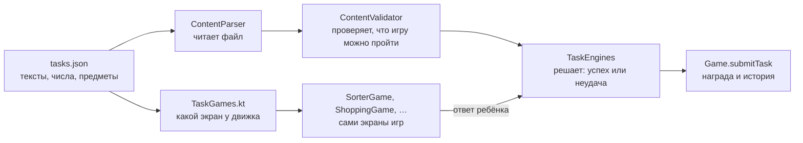

# Мини-игры: как устроены и как их править

Руководство для всей команды. Первая половина — для тех, кто правит **тексты, числа и
предметы** (без программирования). Вторая — для тех, кто добавляет или убирает **целый тип игры**
(нужен Kotlin).

Экраны повторяют концепты шести игр из артефактов — ссылки в описании PR.

## Где мини-игры в приложении

Главный экран → меню (☰) → **«Мини-игры»**. Там шесть карточек с картинками — по одной на игру,
в варианте под текущий уровень питомца («сложность 2 из 3», см. [ниже](#сложность-по-уровням)). Нажатие
открывает игру, и всё происходит в её сцене — в комнате Финни, в магазине, на поле, у лавки,
за кассой:

```
вступление (питомец рассказывает, что делать)  →  игра  →  итог по пунктам + награда  →  «Ещё раз» / «Дальше»
```

Итог и объяснение показываются **при любом исходе** (ТЗ п. 2.5.8). Посреди игры ничего не
списывается и не засчитывается: засчитывается только нажатие последней кнопки игры.

## Шесть мини-игр

| Игра | id | Движок | Тема ТЗ | Чему учит |
|---|---|---|---|---|
| Конвейер | `game_sorter` | `sorter` | планирование | отличать нужное от желаемого |
| Список покупок | `game_shopping` | `basket` | покупки | покупать по списку в пределах денег, сравнивать упаковки |
| Дорога к цели | `game_race` | `goal_race` | сбережения | откладывать понемногу, но регулярно |
| Дождливый день | `game_rainy` | `reserve` | планирование | оставлять запас на непредвиденное |
| Лимонадная лавка | `game_lemonade` | `stand` | планирование | получил − потратил = осталось |
| Касса Финни | `game_cashier` | `change` | покупки | сдача и оплата без сдачи |

Мини-игра — это **обычное задание**, только со своим движком. Поэтому у неё сами собой
работают награда (15 за успех, 5 за первую неудачу), отметка «пройдено», очки за период,
история операций и демо-режим. Ничего отдельного для мини-игр в экономике нет.

## Сложность по уровням

У каждой игры три варианта: свои числа и тексты, тот же движок и та же тема. Вариант
открывается уровнем питомца (`unlockLevel`), и в списке у игры всегда стоит **самый сложный
из открытых**. Уровни ступенькой, чтобы на каждом новом уровне с 2 по 9 что-то менялось:

| Уровень | Что становится сложнее |
|---|---|
| 2 | Касса: сдача с 30 и 50, оплата 18 без сдачи |
| 3 | Конвейер: вещи для школы и дома, «шапка зимой» и «вторая шапка» |
| 4 | Список покупок: сравнить три упаковки сока, денег впритык · Дорога к цели: конструктор за 70, 8 дней, 4 соблазна |
| 5 | Касса: сдача до 42, неудобный кошелёк (6 = 2 + 2 + 2) · Дождливый день: 80 монет, сюрприз 20 |
| 6 | Конвейер: одна вещь бывает и нужной, и «хочется» · Лимонадная лавка: 9 гостей, деление с остатком |
| 7 | Список покупок: поход на 3 дня, 4 пункта, ровно 60 |
| 8 | Дорога к цели: ролики за 100, доход 15, свободных монет всего 10 |
| 9 | Дождливый день: 100 монет, 4 нужных траты, сюрприз 25 · Лимонадная лавка: большие лимоны по 3 стакана, 13 гостей |

Как это работает:

- **Для ТЗ игра — одно задание**, варианты — его сложность. Шесть игр по трём темам закрывают
  минимум п. 2.6; тест «минимальный объём контента» считает игры, а не варианты.
- **Сложный вариант закрыт до своего уровня**: `Game.isTaskAvailable` проверяет и период, и уровень.
  В демо-режиме открыто всё (ТЗ п. 2.5.8), но карточка всё равно показывает вариант по уровню —
  за демо-сценарий (5 периодов, уровень до 9) эксперт видит, как игры усложняются.
- **Награда у каждого варианта своя**: новый вариант — новые 15 монет за успех. Очки за
  задания по-прежнему не больше 2 за период, так что на уровень это не влияет.
- **Итоги периода** после нового уровня пишут, какие игры стали сложнее.
- Старые варианты не пропадают из данных: попытки хранятся по `id`, отметка «пройдено» у
  карточки — про текущий вариант.

Задания в приложении — только эти шесть игр. Прежние задания-формы удалены: каждое целиком
закрывает одна из игр, таблица соответствия — в [content-tasks.md](content-tasks.md).

## Как это устроено — в одной картинке



Правило, которое держит всё вместе: **экран игры ничего не решает сам**. Он собирает ответ
ребёнка и отдаёт его ядру; успех, неудачу и награду считает `TaskEngines` — тот же код,
который проверяют unit-тесты. Поэтому поправить числа в JSON безопасно: логика не меняется.

| Что | Где | Кто правит |
|---|---|---|
| Тексты, числа, предметы игр | `app/src/main/assets/content/tasks.json` | [@vsvsokol] |
| Термины «запас», «сдача», «заработал» | `app/src/main/assets/content/glossary.json` | [@vsvsokol] |
| Картинки предметов | `design/exports/items/` → `tools/pack_items.py` | [@Lix2w78], [@mitzzi4] |
| Правила успеха (движки) | `domain/tasks/TaskEngines.kt`, модели — `domain/model/Tasks.kt` | [@lemonke68] |
| Проверка JSON | `content/ContentValidator.kt` | [@lemonke68] |
| Экраны игр и их сцены | `ui/tasks/games/` — по файлу на игру, общая сцена `GameScene.kt` | [@zYafALL] |
| Список игр, вступление и итог | `ui/tasks/TasksScreen.kt`, `ui/tasks/TaskScreen.kt` | [@zYafALL] |

---

## Часть 1. Правки без программирования

Всё ниже — правка одного файла `app/src/main/assets/content/tasks.json`. Это список
в квадратных скобках, каждая игра — блок в фигурных скобках.

### Общие поля у каждой игры

| Поле | Что это | Пример |
|---|---|---|
| `id` | уникальное имя, латиницей, **не менять у существующих** — по нему хранятся попытки | `"game_sorter"` |
| `engine` | тип игры, из шести возможных (см. ниже) | `"sorter"` |
| `theme` | тема ТЗ: `planning`, `savings` или `shopping` | `"planning"` |
| `title` | название в списке и на вступлении | `"Конвейер"` |
| `intro` | что делать — 1–2 фразы | |
| `explainOk` | объяснение после успеха | |
| `explainFail` | объяснение после неудачи — **обязательно со следующим шагом** (ТЗ п. 2.5.9) | |
| `reward` | *(необязательно)* своя награда: `{ "success": 20, "fail": 5 }` | |
| `series` | к какой игре относится вариант: у всех трёх вариантов «Кассы» — `"cashier"`. Без поля задание — само себе игра | `"cashier"` |
| `unlockLevel` | *(необязательно)* с какого уровня питомца открыт вариант, 1–9, по умолчанию 1; в демо-режиме всё открыто | `5` |
| `unlockPeriod` | *(необязательно)* с какого периода открыта, по умолчанию 1; в демо-режиме всё открыто | `3` |

### Картинка предмета: `art`

У любого предмета, цели, соблазна или раунда кассы можно указать:

- `"art": "item_food_apple"` — имя картинки из `app/src/main/res/drawable-nodpi/` без `.webp`;
- ничего — тогда в кружке будет первая буква названия, пока художники не нарисуют предмет.

Опечатка в `art` игру не ломает — покажется буква. Эмодзи в играх нет ни в картинках, ни в
тексте: поле `emoji` парсер не примет, а `ContentTest` падает, если эмодзи попал в строку JSON.

**Как добавить новую картинку.** Положить PNG в `design/exports/items/` с именем
`item_<что-то>.png`, прописать `"art": "item_<что-то>"` в JSON и запустить из корня репозитория:

```bash
python tools/pack_items.py
```

Скрипт сам найдёт все `art` в `tasks.json`, обрежет поля и положит WebP в ресурсы.

### Поля каждого движка

**`sorter` — Конвейер.** `items` — вещи по порядку появления на ленте:
`id`, `label`, `category` (`needs` / `wants`), `why` — фраза, которую ребёнок увидит, если
ошибётся. `minCorrect` — сколько вещей нужно отнести верно с первого раза.

**`basket` — Список покупок.** `limit` — сколько денег. `shelf` — товары: `id`, `label`,
`price`, `category`, `qty` (штук в упаковке, по умолчанию 1). `preloaded` — что лежит в тележке
с самого начала. `rules` — условия успеха:

| Правило | Выполнено, если | Строка в списке покупок |
|---|---|---|
| `{ "type": "anyOf", "items": ["soap", "soap_liquid"], "label": "Мыло" }` | взят хотя бы один | да, если есть `label` |
| `{ "type": "minQty", "items": ["apple2", "apple5"], "qty": 4, "label": "4 яблока" }` | штук вместе ≥ `qty` | да, если есть `label` |
| `{ "type": "hasCategory", "category": "needs" }` | есть хоть что-то нужное | нет |
| `{ "type": "includes", "item": "apple5" }` | этот товар взят | нет |
| `{ "type": "excludes", "item": "robot" }` | этот товар не взят | нет |

Перебор денег — не неудача: касса пишет «не хватает N» и даёт убрать лишнее.

**`goal_race` — Дорога к цели.** `goal` — `{ "label", "price", "art" }`. `days` — сколько
ходов, `incomePerDay` — доход в день, `step` — шаг взноса (5), `startSaved` — сколько в
копилке на старте. `events` — соблазны: `{ "day": 4, "label": "Мороженое", "price": 5 }`.
Успех — копилка набрала `goal.price`.

**`reserve` — Дождливый день.** `amount` — деньги на неделю. `spendings` — траты: `id`, `label`,
`price`, `category`. Нужное всегда в плане и не переносится. `surprise` — непредвиденное:
`{ "label", "text", "price" }`. Успех — запаса хватило без переноса покупок.

**`stand` — Лимонадная лавка.** `budget` — деньги на закупку. `ingredient` —
`{ "label": "Лимон", "price": 5, "yields": 2 }` (`yields` — стаканов из одной штуки).
`cupPrice` — цена стакана, `guests` — сколько придёт гостей, `forecast` — фраза про погоду;
**число гостей в ней должно совпадать с `guests`**. Успех — сырья ровно на всех гостей.

**`change` — Касса.** `coins` — номиналы в ящике. `rounds` — раунды по порядку:
`{ "mode": "give", "label": "Сок", "price": 17, "paid": 20 }` — отсчитать сдачу;
`{ "mode": "exact", "label": "Молоко", "price": 17, "wallet": [10, 5, 5, 2, 1, 1] }` — заплатить
ровно из кошелька. `minCorrect` — сколько раундов верно с первой попытки (по умолчанию все).

### Как убрать мини-игру

1. Удалить её блок `{ … }` из `tasks.json`. Следить за запятыми между блоками.
   **Сам файл не удалять**: без него приложение не запустится.
   Игра целиком — это все блоки с её `series`; один вариант можно убрать, остальные останутся.
2. В `app/src/test/java/ru/finney/pet/content/ContentTest.kt` удалить строку с её `id` в списке
   `cases` (для `game_sorter` и `game_cashier` — соответствующие строки в тесте
   «мини-игры с ответами из самого контента»). Иначе тест скажет «нет задания …».
   Это касается только первых вариантов: остальные тест проверяет сам, по числам из JSON.

**Осторожно с минимумом ТЗ п. 2.6: не меньше 6 заданий по 3 темам.** Сейчас ровно шесть игр,
и тест «минимальный объём контента» покраснеет, если убрать хоть одну. Убирая игру, добавьте
вместо неё другую — например, «Конвейер» на другие вещи (ниже).

Экран игры и движок при этом остаются в коде: они понадобятся, если игру вернут.
Убрать тип игры совсем — в части 2.

### Как добавить ещё одну игру на готовом движке

Например, «Конвейер» про школьные вещи отдельной карточкой:

1. Скопировать блок `game_sorter` целиком, поставить после него через запятую.
2. Поменять `id` на новый (`game_sorter_school`), `series` на новый (`sorter_school`), `title`,
   `intro`, объяснения и вещи.
3. Запустить проверку (ниже). Код трогать не нужно — это и есть ТЗ п. 2.5.14.

### Как добавить вариант сложности

То же самое, но `series` оставить как у игры, а `unlockLevel` поставить свободный: у двух
вариантов одной игры уровень не может совпадать. Числа в `intro` и объяснениях должны
совпадать с числами в полях — их проверяет только человек. Тест сам проверит, что новый
вариант можно и выиграть, и проиграть.

### Проверка после любой правки

```bash
./gradlew :app:testDebugUnitTest
```

Тест `ContentTest` читает настоящий JSON и сообщает понятными словами, что не так:
`задание game_race — цель не набрать, даже если откладывать всё` или
`задание game_cashier, раунд 3 — 17 не набрать из кошелька [10, 5, 1]`. Проверяется не
только опечатка, но и то, что **игру вообще можно выиграть**. Если тест красный — приложение
с таким контентом не запустится, так что его лучше увидеть в CI, а не на защите.

Про запуск Gradle на этой машине: нужен `JAVA_HOME` из Android Studio —
`export JAVA_HOME="/c/Program Files/Android/Android Studio/jbr"`.

Правила текстов для детей 7–11 лет — в [content-tasks.md](content-tasks.md#правила-написания-текстов):
короткие фразы, не стыдить и не пугать, в объяснении неудачи всегда следующий шаг, никаких
банков, процентов и брендов.

---

## Часть 2. Новый тип игры или удаление типа (нужен Kotlin)

Тип игры = движок. Их восемь: шесть заняты играми (`sorter`, `basket`, `goal_race`, `reserve`,
`stand`, `change`), ещё два — `distributor` и `goal_slider` — остались от прежних заданий: в
контенте их нет, но задание на них можно вернуть одной записью, для них есть простые экраны. Ядро — зона [@lemonke68]
(см. CODEOWNERS), поэтому такие PR он ревьюит обязательно.

### Добавить движок — шесть мест

| Шаг | Файл | Что сделать |
|---|---|---|
| 1 | `domain/model/Tasks.kt` | класс задания `@Serializable @SerialName("мой_движок") data class МойTask(…) : TaskDefinition()` с общими полями, как у соседей |
| 2 | `domain/tasks/TaskEngines.kt` | ввод в `TaskInput`, итог в `TaskDetails`, ошибки ввода в `TaskInputError`, строка в `evaluate` и функция оценки |
| 3 | `content/ContentValidator.kt` | ветка в `when (task)`: проверить числа и что игру можно выиграть |
| 4 | `ui/tasks/games/МояGame.kt` | экран игры: собирает ответ и вызывает `onSubmit(TaskInput.…)` |
| 5 | `ui/tasks/games/TaskGames.kt` | ветки в `TaskGame` (экран), `backdropFor` (сцена), `taskIcon` (картинка в списке) и `ResultBody` (итог) |
| 6 | тесты | движок — в `MiniGamesTest`, настоящий контент — в `ContentTest` |

Компилятор подскажет сам: `TaskDefinition` и `TaskDetails` — `sealed`, и пока в
`TaskGame`, `ResultBody` или валидаторе нет ветки для нового класса, проект не соберётся.

Для экрана есть готовые детали. В `GameScene.kt`: сцена `GameScene` (фон, деньги, крестик),
фоны `Backdrop` (комната, дождь, магазин, поле, небо, закат, касса), питомец `ScenePet`, гости
`Guest`, реплика `Bubble`, панель с заголовком на рамке `ScenePanel`, шкала `Meter`, плашка
жеста `GestureHint`. В `GameParts.kt`: картинка `ItemPicture`, монета с номиналом
`DenominationCoin`, `Stepper` с «−» и «+», заметка `Note`, строка `SumRow`.

Правила для экрана:

- **Решает ядро, а не экран.** Если экрану нужно подсветить «верно» заранее (галочки списка,
  итог лавки), он вызывает ту же функцию ядра: `TaskEngines.ruleMet`, `standDay`,
  `changeDiff`, `reserveLeft`. Считать своими формулами нельзя — разойдётся с оценкой.
- **Без таймеров и проигрыша на время** (ТЗ п. 8.1). Каждое действие — по нажатию.
- **Каждое действие доступно нажатием**, а не только жестом: смахивание в «Конвейере»
  дублируют кнопки-корзины.
- **Цвет — не единственный сигнал** (ТЗ п. 3.6): рядом всегда слово или значок.
- **В оценку идёт первый ответ**, а исправлять после подсказки можно сколько угодно.

### Убрать тип игры совсем

Обратный порядок: удалить все задания этого движка из JSON → ветки в `TaskGames.kt` и
`ContentValidator.kt` → файл экрана → класс в `Tasks.kt`, ввод, итог и ошибки в
`TaskEngines.kt` → тесты движка. Если после удаления класса в JSON осталось задание с
этим `engine`, приложение при старте сообщит об ошибке контента — так и задумано.

---

## Известные ограничения

- **Проверено не до конца.** Код собран, 89 unit-тестов зелёные. Перед демонстрацией пройти
  все шесть игр на физическом устройстве (ТЗ п. 3.1) — и выигрыш, и проигрыш. Варианты
  уровней 2–9 на устройстве открывалась только «Касса» второго уровня.
- **Буква вместо рисунка** у предметов без картинки: мячик, наклейки, куртка, щётка, самокат,
  зонт, лимон, книжка, конструктор, ролики и школьные вещи из новых вариантов. Нужны рисунки
  в стиле кита — `design/exports/items/item_*.png`, потом `pack_items.py`.
- **Картинка ищется по имени** (`getIdentifier`). Сейчас сжатие ресурсов в релизе выключено;
  если его включат (`isShrinkResources = true`), картинки мини-игр нужно будет пометить
  `tools:keep`, иначе их вырежут как неиспользуемые.
- **Анимации игр** — смахивание в «Конвейере», «+5» в лавке и дыхание питомца; дождь и
  остальное статичны. Переключателя «выключить анимации» (ТЗ п. 3.6) в приложении ещё нет.

[@lemonke68]: https://github.com/lemonke68
[@Lix2w78]: https://github.com/Lix2w78
[@mitzzi4]: https://github.com/mitzzi4
[@vsvsokol]: https://github.com/vsvsokol
[@zYafALL]: https://github.com/zYafALL
