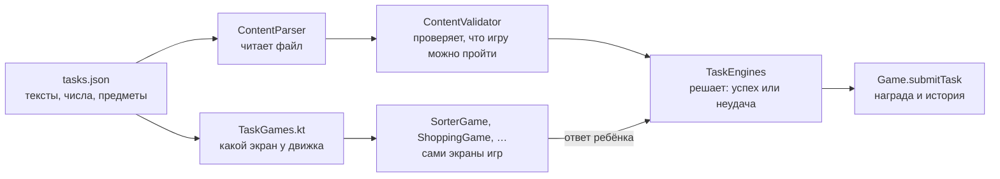

# Мини-игры: как устроены и как их править

Руководство для всей команды. Первая половина — для тех, кто правит **тексты, числа и
предметы** (без программирования). Вторая — для тех, кто добавляет или убирает **целый тип игры**
(нужен Kotlin).

Экраны первых шести игр повторяют концепты из артефактов — ссылки в описании PR. «Проверь чек»
и «Подработка» сделаны позже, в том же стиле и из тех же деталей.

## Где мини-игры в приложении

Ребёнок видит одну игру — **игру уровня**: плашка над комнатой на главном. Её пройти обязательно,
чтобы пройти уровень. Она случайная: сначала из игр, которых ещё не было, потом — любая, кроме прошлой
(docs/economy.md, раздел 8).

Полный список — только в отладочной сборке: долгое нажатие на значок уровня → панель отладки →
**«Все мини-игры»**. Там восемь карточек с картинками — по одной на игру,
в варианте под текущий уровень питомца (сложность — точками, см. [ниже](#сложность-по-уровням)). Нажатие
открывает игру, и всё происходит в её сцене — в комнате Финни, в магазине, на поле, у лавки,
за кассой:

```
вступление (питомец рассказывает, что делать)  →  игра  →  итог по пунктам + награда  →  «Ещё раз» / «Дальше»
```

Итог и объяснение показываются **при любом исходе** (ТЗ п. 2.5.8). Посреди игры ничего не
списывается и не засчитывается: засчитывается только нажатие последней кнопки игры.

## Восемь мини-игр

| Игра | id | Движок | Тема ТЗ | Чему учит |
|---|---|---|---|---|
| Конвейер | `game_sorter` | `sorter` | планирование | отличать нужное от желаемого |
| Список покупок | `game_shopping` | `basket` | покупки | покупать по списку в пределах денег, сравнивать упаковки |
| Дорога к цели | `game_race` | `goal_race` | сбережения | откладывать понемногу, но регулярно |
| Дождливый день | `game_rainy` | `reserve` | планирование | оставлять запас на непредвиденное |
| Лимонадная лавка | `game_lemonade` | `stand` | планирование | получил − потратил = осталось |
| Касса Финни | `game_cashier` | `change` | покупки | сдача и оплата без сдачи |
| Проверь чек | `game_receipt` | `receipt` | покупки | сверять чек с покупками и сдачу — кассир тоже ошибается |
| Подработка | `game_chores` | `chores` | планирование | деньги — за работу, время тоже ресурс, отдых нужен |

Мини-игра — это **обычное задание**, только со своим движком. Поэтому у неё сами собой
работают награда (15 за успех, 5 за первую неудачу), отметка «пройдено», история операций
и демо-режим. Ничего отдельного для мини-игр в экономике нет. Играть можно только после
плана уровня (`PLAN_NOT_CONFIRMED`), на экране вместо «Играть» — «Составить план».

## Сложность по уровням

У каждой игры три варианта: свои числа и тексты, тот же движок и та же тема. Вариант
открывается уровнем питомца (`unlockLevel`), и в списке у игры всегда стоит **самый сложный
из открытых**. Уровни ступенькой, чтобы на каждом новом уровне с 2 по 6 что-то менялось
(уровней шесть, уровень = стадия = период, docs/economy.md, раздел 8):

| Уровень | Что становится сложнее |
|---|---|
| 2 | Касса: сдача с 30 и 50, оплата 18 без сдачи |
| 3 | Конвейер: вещи для школы и дома, «шапка зимой» и «вторая шапка» · Проверь чек: не та цена и дубль сразу |
| 4 | Список покупок: сравнить три упаковки сока, акция на одну из них — какая, заранее неизвестно · Дорога к цели: конструктор за 70, 8 дней, 4 соблазна — радость нужна не только в конце · Подработка: собака дороже в последние дни, соседке помогают только во 2-й и 4-й, бонус за три разных дела, два дня отдыха |
| 5 | Касса: сдача до 47, неудобный кошелёк (6 = 2 + 2 + 2) · Дождливый день: 80 монет, сюрпризы 10 и 15 — случатся ли, неизвестно · Лимонадная лавка: 7–11 гостей, всегда нечётно — деление с остатком · Список покупок: поход на 3 дня, 4 пункта, ровно 60 · Проверь чек: два одинаковых — не ошибка, сдача меньше на 5 |
| 6 | Конвейер: одна вещь бывает и нужной, и «хочется» · Дорога к цели: ролики за 100, доход 15, свободных монет всего 10 — две радости по 5, и пораньше · Дождливый день: 100 монет, 4 нужных траты, три возможных сюрприза · Лимонадная лавка: большие лимоны по 3 стакана, 10–14 гостей · Подработка: уборка на весь день дороже в конце недели, бонус за четыре разных дела, цель 100–110 |

Было девять уровней: варианты уровней 7–9 и второй вариант лавки сдвинуты на 5–6, когда
уровень, стадия и период стали одним и тем же (27.09).

Как это работает:

- **Для ТЗ игра — одно задание**, варианты — его сложность. Восемь игр по трём темам закрывают
  минимум п. 2.6; тест «минимальный объём контента» считает игры, а не варианты.
- **Сложный вариант закрыт до своего уровня**: `Game.isTaskAvailable` проверяет и период, и уровень.
  В демо-режиме открыто всё (ТЗ п. 2.5.8), но карточка всё равно показывает вариант по уровню —
  за демо-сценарий (5 периодов, уровень до 6) эксперт видит, как игры усложняются.
- **Награда у каждого варианта своя**: новый вариант — новые 15 монет за успех. На уровень
  игры не влияют: он растёт за нужное, план и копилку.
- **Итоги уровня** после нового уровня пишут, какие игры стали сложнее.
- Старые варианты не пропадают из данных: попытки хранятся по `id`, отметка «пройдено» у
  карточки — про текущий вариант.

Задания в приложении — только эти восемь игр. Прежние задания-формы удалены: каждое целиком
закрывает одна из игр, таблица соответствия — в [content-tasks.md](content-tasks.md).

## Как это устроено — в одной картинке


```mermaid
flowchart LR
    J["tasks.json<br/>тексты, числа, предметы"] --> P["ContentParser<br/>читает файл"]
    P --> V["ContentValidator<br/>проверяет, что игру можно пройти"]
    V --> E["TaskEngines<br/>решает: успех или неудача"]
    E --> G["Game.submitTask<br/>награда и история"]
    J --> U["TaskGames.kt<br/>какой экран у движка"]
    U --> S["SorterGame, ShoppingGame, …<br/>сами экраны игр"]
    S -- "ответ ребёнка" --> E
```

Правило, которое держит всё вместе: **экран игры ничего не решает сам**. Он собирает ответ
ребёнка и отдаёт его ядру; успех, неудачу и награду считает `TaskEngines` — тот же код,
который проверяют unit-тесты. Поэтому поправить числа в JSON безопасно: логика не меняется.

| Что | Где | Кто правит |
|---|---|---|
| Тексты, числа, предметы игр | `app/src/main/assets/content/tasks.json` | [@vsvsokol] |
| Термины «запас», «сдача», «заработал» | `app/src/main/assets/content/glossary.json` | [@vsvsokol] |
| Картинки предметов | `design/exports/items/` → `tools/pack_items.py` | [@Lix2w78], [@mitzzi4] |
| Правила успеха (движки) | `domain/tasks/TaskEngines.kt`, модели — `domain/model/Tasks.kt` | [@lemonke68] |
| Проверка JSON | `content/ContentValidator.kt`, игры — `domain/tasks/TaskChecks.kt` | [@lemonke68] |
| Случайные числа | `domain/tasks/TaskGenerator.kt` | [@lemonke68] |
| Экраны игр и их сцены | `ui/tasks/games/` — по файлу на игру, общая сцена `GameScene.kt` | [@zYafALL] |
| Список игр, вступление и итог | `ui/tasks/TasksScreen.kt`, `ui/tasks/TaskScreen.kt` | [@zYafALL] |

---

## Часть 1. Правки без программирования

Всё ниже — правка одного файла `app/src/main/assets/content/tasks.json`. Это список
в квадратных скобках, каждая игра — блок в фигурных скобках.

### Общие поля у каждой игры

| Поле | Что это | Пример |
|---|---|---|
| `id` | уникальное имя, латиницей, **не менять у существующих** — по нему хранятся попытки | `"game_sorter"` |
| `engine` | тип игры, из восьми возможных (см. ниже) | `"sorter"` |
| `theme` | тема ТЗ: `planning`, `savings` или `shopping` | `"planning"` |
| `title` | название в списке и на вступлении | `"Конвейер"` |
| `intro` | что делать — 1–2 фразы | |
| `explainOk` | объяснение после успеха | |
| `explainFail` | объяснение после неудачи — **обязательно со следующим шагом** (ТЗ п. 2.5.9) | |
| `reward` | *(необязательно)* своя награда: `{ "success": 20, "fail": 5 }` | |
| `series` | к какой игре относится вариант: у всех трёх вариантов «Кассы» — `"cashier"`. Без поля задание — само себе игра | `"cashier"` |
| `unlockLevel` | *(необязательно)* с какого уровня питомца открыт вариант, 1–6 (`maxLevel`), по умолчанию 1; в демо-режиме всё открыто | `5` |
| `unlockPeriod` | *(необязательно)* с какого периода открыта, по умолчанию 1; в демо-режиме всё открыто | `3` |

### Картинка предмета: `art` или `emoji`

У любого предмета, цели, соблазна или раунда кассы можно указать:

- `"art": "item_food_apple"` — имя картинки из `app/src/main/res/drawable-nodpi/` без `.webp`;
- `"emoji": "⚽"` — временный значок, пока рисунка нет;
- ничего — тогда в кружке будет первая буква названия.

Если указаны оба, берётся картинка. Опечатка в `art` игру не ломает — покажется эмодзи или буква.
**В текстах эмодзи нет**: ни во вступлениях, ни в объяснениях, ни в названиях. `ContentTest`
падает, если эмодзи попал в любую строку JSON, кроме поля `emoji`.

**Как добавить новую картинку.** Положить PNG в `design/exports/items/` с именем
`item_<что-то>.png`, прописать `"art": "item_<что-то>"` в JSON и запустить из корня репозитория:

```bash
python tools/pack_items.py
```

Скрипт сам найдёт все `art` в `tasks.json`, обрежет поля и положит WebP в ресурсы.

### Поля каждого движка

**`sorter` — Конвейер.** `items` — вещи по порядку появления на ленте:
`id`, `label`, `category` (`needs` / `wants`), `why` — фраза, которую ребёнок увидит, если
ошибётся. `minCorrect` — сколько вещей нужно отнести верно с первого раза.

**`basket` — Список покупок.** `limit` — сколько денег. `shelf` — товары: `id`, `label`,
`price`, `category`, `qty` (штук в упаковке, по умолчанию 1), `promo` — надпись акции на
ценнике («Акция!»; в `price` уже цена со скидкой). `preloaded` — что лежит в тележке
с самого начала. `goalText` — цель одной фразой над списком: «Купи всё из списка и уложись
в {limit}». Акция на одну упаковку: весь `shelf` — `{"oneOf": [полка 1, полка 2]}`, в каждой
акция на своей упаковке, а `limit` такой, что уложиться можно, только посчитав цену за штуку.
`rules` — условия успеха:

| Правило | Выполнено, если | Строка в списке покупок |
|---|---|---|
| `{ "type": "anyOf", "items": ["soap", "soap_liquid"], "label": "Мыло" }` | взят хотя бы один | да, если есть `label` |
| `{ "type": "minQty", "items": ["apple2", "apple5"], "qty": 4, "label": "4 яблока" }` | штук вместе ≥ `qty` | да, если есть `label` |
| `{ "type": "hasCategory", "category": "needs" }` | есть хоть что-то нужное | нет |
| `{ "type": "includes", "item": "apple5" }` | этот товар взят | нет |
| `{ "type": "excludes", "item": "robot" }` | этот товар не взят | нет |

Перебор денег — не неудача: касса пишет «не хватает N» и даёт убрать лишнее.

**`goal_race` — Дорога к цели.** `goal` — `{ "label", "price", "art" или "emoji" }`. `days` — сколько
ходов, `incomePerDay` — доход в день, `step` — шаг взноса (5), `startSaved` — сколько в
копилке на старте. `events` — соблазны: `{ "day": 4, "label": "Мороженое", "price": 5 }`,
не больше одного в день. `mood` — сердечки настроения Финни на старте, они же максимум (3).
Отказался от соблазна дня — сердечко гаснет, позволил себе — загорается, выше `mood` не бывает.
Погасли все — Финни грустит до конца дороги, поздняя радость его уже не выручает.
Успех — копилка набрала `goal.price` **и** к финишу горит хоть одно сердечко.

Зачем сердечки: без них игра проходилась, если каждый день откладывать всё и ничего не
тратить, а учить она должна «понемногу, но регулярно». Теперь «откладывать всё» — всегда
«Почти!»: копилка полная, Финни грустный. Числа подбираются так, чтобы свободных монет
хватало на одну-две маленькие радости, а соблазнов было не меньше, чем сердечек, — иначе
отказ от всех ничего не стоит. `ContentValidator` проверяет оба условия: «откладывать всё»
не выигрывает, а хотя бы один набор радостей до цели доводит.

| Вариант | Свободных монет | Соблазнов | Выигрывают |
|---|---|---|---|
| Самокат, ур. 1 | 10 | 3 | любая одна радость или две по 5 |
| Конструктор, ур. 4 | 10 | 4 | одна-две радости, но без трёх отказов подряд (одни наклейки или одна игрушка — мало) |
| Ролики, ур. 8 | 10 | 5 | только две радости по 5 и без трёх отказов подряд: вата и наклейки или наклейки и мороженое |

**`reserve` — Дождливый день.** `amount` — деньги на неделю. `spendings` — траты: `id`, `label`,
`price`, `category`. Нужное всегда в плане. `surprises` — что может случиться, у каждого
сюрприза вероятность: `{ "chance": 60, "value": { "label", "text", "price", "art" } }`. Какие
случились, решает зерно попытки — бывает ни одного, бывает все. Не хватило запаса — ребёнок
переносит траты, в том числе нужное. **Успех — нужное не перенесено; бонус к награде — если
ещё и хоть одно желаемое осталось в плане.** Что не потрачено, остаётся «на потом» — это
видно в итоге. Валидатор требует, чтобы после нужного хватало на все сюрпризы сразу.

**`stand` — Лимонадная лавка.** `budget` — деньги на закупку. `ingredient` —
`{ "label": "Лимон", "price": 5, "yields": 2 }` (`yields` — стаканов из одной штуки).
`cupPrice` — цена стакана, `guests` — сколько придёт гостей, `forecast` — фраза про погоду;
число гостей в ней — подстановкой `{guests}`, чтобы совпадало с полем. Успех — сырья ровно
на всех гостей. Числа движка для текстов (см. [«Случайные числа»](#случайные-числа)):
`{bestStock}`, `{bestCups}`, `{bestSpent}`, `{bestEarned}`, `{bestLeftover}` — закупка ровно
на всех гостей и её итог; `{fewerStock}`, `{fewerCups}`, `{fewerMissed}` — на одну штуку
меньше.

**`change` — Касса.** `coins` — номиналы в ящике. `rounds` — раунды по порядку:
`{ "mode": "give", "label": "Сок", "price": 17, "paid": 20 }` — отсчитать сдачу;
`{ "mode": "exact", "label": "Молоко", "price": 17, "wallet": [10, 5, 5, 2, 1, 1] }` — заплатить
ровно из кошелька. `minCorrect` — сколько раундов верно с первой попытки (по умолчанию все).

**`receipt` — Проверь чек.** `cart` — что в пакете: `id`, `label`, `price` (как на ценнике),
`qty` (штук, по умолчанию 1). `lines` — строки чека по одной на штуку: `{ "id": "l1", "item": "juice", "price": 12 }`.
`paid` — сколько дали кассиру, `change` — сколько сдачи он вернул. Ошибки не пишутся —
их находит ядро: строк товара больше `qty` (дубль), цена строки выше ценника, сдача меньше
`paid − сумма чека`. Из двух одинаковых строк засчитывается любая. Успех — отмечены все
ошибки и ничего лишнего. Валидатор не пускает ошибки в пользу покупателя (дешевле ценника,
недопробито, лишняя сдача), у одного товара — только одну ошибку и чек совсем без ошибок.

**`chores` — Подработка.** `goal` — `{ "label", "price", "art" }`. `days` — дней в неделе (до 7),
`hoursPerDay` — часиков в дне (до 3), `minRestDays` — сколько пустых дней нужно (от 1).
`chores` — дела (до 6): `id`, `label`, `hours`, `reward`, `maxTimes` — сколько раз за неделю
его дают (без поля — сколько угодно), `pay` — оплата по дням, по числу на каждый день
(`[20, 20, 20, 20, 30, 30]` — в выходные дороже; без поля — каждый день `reward`), `onDays` —
в какие дни дело дают, с 1 (`[2, 4]`; без поля — в любой).

- `tiredCut` — усталость: дело, которое было и вчера, приносит на столько меньше (не ниже 0).
- `varietyBonus` — сколько добавить к заработку недели за `varietyCount` (по умолчанию 3)
  разных дел. 0 — бонуса нет.

Успех — заработано (с усталостью и бонусом) не меньше цены цели и пустых дней не меньше
`minRestDays`. Валидатор перебором проверяет, что цель набирается, **и что заученная схема
«самое выгодное дело каждый рабочий день» не выигрывает**, если есть усталость.

**Лавка на несколько дней** (тот же движок `stand`). Вместо `guests` и `forecast`:

- `days` — дни, у каждого прогноз и настоящая погода: `{ "forecast": "sun", "weather": "clouds" }`
  (`sun`, `clouds`, `rain`). Чтобы погода была случайной, день — `oneOf` из пар: чем чаще пара
  «прогноз = погода», тем надёжнее прогноз.
- `demand` — гостей в такую погоду при цене `cupPrice`: `{ "sun": 10, "clouds": 6, "rain": 2 }`.
- `prices` — цены стакана на выбор, `guestsPerCoin` — на столько гостей меньше за каждую
  монету выше `cupPrice` (и больше — за каждую ниже).
- `freshDays` — сколько дней лимон годен (2: купил утром — годен сегодня и завтра).
- `goalProfit` — прибыль за все дни, нужная для победы.

Каждое утро ребёнок выбирает, сколько купить и почём продавать; вечером видит итог дня.
Остатки лимонов переходят на завтра (выжимаются сначала старые), просроченные портятся.
Валидатор проверяет, что порог достижим, если знать погоду заранее, и что «каждый день
скупать на все деньги» не выигрывает.

**Экрана на несколько дней пока нет**, поэтому в `tasks.json` лавка ещё однодневная. Готовый
блок — ниже, он же проверяется тестом `StandWeekTest`. Экрану нужно: утро — закупка и цена
(`TaskInput.StandDays`, по `StandChoice` на день), после каждого дня — вечер из
`TaskEngines.standDays(task, решения по прошедшим дням)` (погода объявляется после выбора),
в конце — итог `TaskDetails.StandWeek`.

```json
{
  "id": "game_lemonade_week", "theme": "planning", "engine": "stand", "title": "Лимонадная лавка",
  "series": "lemonade", "unlockLevel": 1,
  "intro": "Три дня лавки. Каждое утро купи лимоны и выбери цену. Прогноз — подсказка, а не обещание!",
  "explainOk": "Прибыль {goalProfit} есть! Ты смотрел на прогноз, но не скупал лишнего.",
  "explainFail": "Прибыль меньше {goalProfit}. Лимоны портятся через два дня — покупай под прогноз, а не на все деньги.",
  "budget": 30,
  "ingredient": { "label": "Лимон", "price": 5, "yields": 2, "art": "item_food_lemon" },
  "cupPrice": 5, "prices": [4, 5, 6], "guestsPerCoin": 2,
  "demand": { "sun": 10, "clouds": 6, "rain": 2 },
  "freshDays": 2, "goalProfit": 25,
  "days": [
    { "oneOf": [{ "forecast": "sun", "weather": "sun" }, { "forecast": "sun", "weather": "sun" }, { "forecast": "sun", "weather": "clouds" }] },
    { "oneOf": [{ "forecast": "clouds", "weather": "clouds" }, { "forecast": "clouds", "weather": "rain" }, { "forecast": "clouds", "weather": "sun" }] },
    { "oneOf": [{ "forecast": "rain", "weather": "rain" }, { "forecast": "rain", "weather": "clouds" }, { "forecast": "sun", "weather": "sun" }] }
  ]
}
```

### Как убрать мини-игру

1. Удалить её блок `{ … }` из `tasks.json`. Следить за запятыми между блоками.
   **Сам файл не удалять**: без него приложение не запустится.
   Игра целиком — это все блоки с её `series`; один вариант можно убрать, остальные останутся.
2. В `app/src/test/java/ru/finney/pet/content/ContentTest.kt` удалить строку с её `id` в списке
   `cases` (для `game_sorter` и `game_cashier` — соответствующие строки в тесте
   «мини-игры с ответами из самого контента»). Иначе тест скажет «нет задания …».
   Это касается только первых вариантов: остальные тест проверяет сам, по числам из JSON.

**Осторожно с минимумом ТЗ п. 2.6: не меньше 6 заданий по 3 темам.** Сейчас игр восемь,
и тест «минимальный объём контента» покраснеет, если их станет меньше шести. Убирая игру,
следите за этим — или добавьте вместо неё другую, например «Конвейер» на другие вещи (ниже).

Экран игры и движок при этом остаются в коде: они понадобятся, если игру вернут.
Убрать тип игры совсем — в части 2.

### Как добавить ещё одну игру на готовом движке

Например, «Конвейер» про школьные вещи отдельной карточкой:

1. Скопировать блок `game_sorter` целиком, поставить после него через запятую.
2. Поменять `id` на новый (`game_sorter_school`), `series` на новый (`sorter_school`), `title`,
   `intro`, объяснения и вещи.
3. Запустить проверку (ниже). Код трогать не нужно — это и есть ТЗ п. 2.5.14.

### Как добавить вариант сложности

То же самое, но `series` оставить как у игры, а `unlockLevel` поставить свободный: у двух
вариантов одной игры уровень не может совпадать. Числа в `intro` и объяснениях должны
совпадать с числами в полях — их проверяет только человек, поэтому лучше писать их
подстановками (`{guests}`), см. ниже. Тест сам проверит, что новый
вариант можно и выиграть, и проиграть.

### Случайные числа

Чтобы игру нельзя было пройти, запомнив ответ, числа в ней могут меняться от попытки к
попытке. Вместо числа или предмета в любом поле пишется разброс:

| Что написать | Что получится |
|---|---|
| `"guests": { "min": 6, "max": 10 }` | целое от 6 до 10 |
| `"guests": { "min": 6, "max": 10, "step": 2 }` | 6, 8 или 10 (от `min` до `max` должно быть целое число шагов) |
| `"guests": { "oneOf": [10, 11, 13, 14] }` | одно из списка — числа, строки или целые блоки |
| `"spendings": { "pick": 3, "from": [ … ] }` | три элемента из списка, в том же порядке |
| `{ "chance": 30, "value": … }` — элемент списка | элемент есть с вероятностью 30 % («Дождливый день») |

Пример — цена цели «Подработки» от 60 до 70 через 10:

```json
"goal": { "label": "Мяч", "price": { "min": 60, "max": 70, "step": 10 }, "art": "item_toy_ball" }
```

**Подстановки в текстах.** `{guests}`, `{goal.price}`, `{surprises.0.label}`, `{rounds.0.price}`
(номер в списке — с нуля) — значение этого же поля, уже выбранное. Некоторые движки дают и
посчитанные числа: у лавки `{bestStock}` — сколько лимонов купить (список — в описании движка
выше). Опечатка в подстановке — ошибка при загрузке, как и любая другая.

**Нельзя разбросом:** `id`, `engine`, `theme`, `series`, `unlockLevel`, `unlockPeriod`.

Как это работает:

- Каждый раз, когда ребёнок открывает игру или жмёт «Ещё раз», выбираются новые числа.
  Попытка запоминает зерно — число, из которого они выбраны: с тем же зерном выйдут те же
  числа, поэтому попытку можно повторить в тесте.
- Если выпали числа, при которых игру не выиграть (проверки те же, что в тесте ниже), берутся
  следующие. Не сложилось 30 раз — берётся **вариант без случайности**: у разброса `min`,
  у `oneOf` — первое, у `pick` — первые, `chance` — элемент есть. Он же показывается в списках игр, и тест требует,
  чтобы он был выигрываемым.
- Тест перебирает по 300 зёрен каждой игры с разбросом: все варианты выигрываемы, в текстах
  нет недоставленных подстановок, числа правда меняются.
- Следите за словами рядом с числом: «придут {guests} гостей» верно для 5–20, а
  «{bestStock} лимонов» — нет (4 лимона). Помогает порядок «лимонов нужно {bestStock}».

Сейчас разброс есть в «Лимонадной лавке» (гости), «Кассе» (цены в раундах со сдачей),
«Дождливом дне» (какие сюрпризы случились), «Подработке» (цена цели) и «Списке покупок»
(деньги в первом варианте, упаковка с акцией во втором).

### Проверка после любой правки

```bash
./gradlew :app:testDebugUnitTest
```

Тест `ContentTest` читает настоящий JSON и сообщает понятными словами, что не так:
`задание game_race — выигрывает «откладывать всё»: соблазнов меньше, чем сердечек в mood` или
`задание game_cashier, раунд 3 — 17 не набрать из кошелька [10, 5, 1]`. Проверяется не
только опечатка, но и то, что **игру вообще можно выиграть**. Если тест красный — приложение
с таким контентом не запустится, так что его лучше увидеть в CI, а не на защите.

Про запуск Gradle на этой машине: нужен `JAVA_HOME` из Android Studio —
`export JAVA_HOME="/c/Program Files/Android/Android Studio/jbr"`.

Правила текстов для детей 7–11 лет — в [content-tasks.md](content-tasks.md#правила-написания-текстов):
короткие фразы, не стыдить и не пугать, в объяснении неудачи всегда следующий шаг, никаких
банков, процентов и брендов.

---

## Часть 2. Новый тип игры или удаление типа (нужен Kotlin)

Тип игры = движок. Их десять: восемь заняты играми (`sorter`, `basket`, `goal_race`, `reserve`,
`stand`, `change`, `receipt`, `chores`), ещё два — `distributor` и `goal_slider` — остались от прежних заданий: в
контенте их нет, но задание на них можно вернуть одной записью, для них есть простые экраны. Ядро — зона [@lemonke68]
(см. CODEOWNERS), поэтому такие PR он ревьюит обязательно.

### Добавить движок — шесть мест

| Шаг | Файл | Что сделать |
|---|---|---|
| 1 | `domain/model/Tasks.kt` | класс задания `@Serializable @SerialName("мой_движок") data class МойTask(…) : TaskDefinition()` с общими полями, как у соседей |
| 2 | `domain/tasks/TaskEngines.kt` | ввод в `TaskInput`, итог в `TaskDetails`, ошибки ввода в `TaskInputError`, строка в `evaluate` и функция оценки |
| 3 | `domain/tasks/TaskChecks.kt` | ветка в `when (task)`: проверить числа и что игру можно выиграть. Эти же проверки отбрасывают нерешаемые случайные числа |
| 4 | `ui/tasks/games/МояGame.kt` | экран игры: собирает ответ и вызывает `onSubmit(TaskInput.…)` |
| 5 | `ui/tasks/games/TaskGames.kt` | ветки в `TaskGame` (экран), `backdropFor` (сцена), `taskIcon` (картинка в списке) и `ResultBody` (итог) |
| 6 | тесты | движок — в `MiniGamesTest`, настоящий контент — в `ContentTest` |

Компилятор подскажет сам: `TaskDefinition` и `TaskDetails` — `sealed`, и пока в
`TaskGame`, `ResultBody` или валидаторе нет ветки для нового класса, проект не соберётся.

Для экрана есть готовые детали. В `GameScene.kt`: сцена `GameScene` (фон, деньги, крестик),
фоны `Backdrop` (комната, дождь, магазин, поле, небо, закат, касса), питомец `ScenePet`, гости
`Guest`, реплика `Bubble`, обещание награды `PetOffers`, панель с заголовком на рамке
`ScenePanel`, шкала `Meter`. В `GameParts.kt`: картинка `ItemPicture`, монета с номиналом
`DenominationCoin`, `Stepper` с «−» и «+», заметка `Note`, строка `SumRow`, прыгающая
стрелка-подсказка `BouncingArrow`.

Правила для экрана:

- **Решает ядро, а не экран.** Если экрану нужно подсветить «верно» заранее (галочки списка,
  итог лавки), он вызывает ту же функцию ядра: `TaskEngines.ruleMet`, `standDay`,
  `changeDiff`, `reserveLeft`, `receiptErrors`, `dayHours`, `choresEarned`. Считать своими
  формулами нельзя — разойдётся с оценкой.
- **Без таймеров и проигрыша на время** (ТЗ п. 8.1). Каждое действие — по нажатию.
- **Каждое действие доступно нажатием**, а не только жестом: смахивание в «Конвейере»
  дублируют кнопки-корзины.
- **Цвет — не единственный сигнал** (ТЗ п. 3.6): рядом всегда слово или значок.
- **Минимум слов.** Числа — с монеткой, подсказка действия — жестом (`BouncingArrow`,
  полупрозрачный предмет в играх ухода), счётчики — точками. Словами остаются только
  объяснение итога (`explainOk` / `explainFail`, ТЗ п. 2.5.8) и то, что без слов не понять
  («Не хватает 5. Что перенесём?»). Всё убранное с экрана говорится TalkBack через
  `contentDescription`.
- **В оценку идёт первый ответ**, а исправлять после подсказки можно сколько угодно.

### Убрать тип игры совсем

Обратный порядок: удалить все задания этого движка из JSON → ветки в `TaskGames.kt` и
`TaskChecks.kt` → файл экрана → класс в `Tasks.kt`, ввод, итог и ошибки в
`TaskEngines.kt` → тесты движка. Если после удаления класса в JSON осталось задание с
этим `engine`, приложение при старте сообщит об ошибке контента — так и задумано.

---

## Известные ограничения

- **Проверено не до конца.** Код собран, 89 unit-тестов зелёные. Перед демонстрацией пройти
  все шесть игр на физическом устройстве (ТЗ п. 3.1) — и выигрыш, и проигрыш. Варианты
  уровней 2–9 на устройстве открывалась только «Касса» второго уровня.
- **Дела «Подработки» пока эмодзи** (лейка, посуда, собака, веник — поле `emoji`), остальные
  предметы — рисунки. Когда дела нарисуют: `design/exports/items/` → `tools/pack_items.py`,
  в JSON заменить `emoji` на `art`.
  `ContentTest` проверяет, что у каждого `art` есть файл в `drawable-nodpi`.
- **Картинка ищется по имени** (`getIdentifier`). Сейчас сжатие ресурсов в релизе выключено;
  если его включат (`isShrinkResources = true`), картинки мини-игр нужно будет пометить
  `tools:keep`, иначе их вырежут как неиспользуемые.
- **Анимации игр** — смахивание в «Конвейере», «+5» в лавке и дыхание питомца; дождь и
  остальное статичны. «Анимации: выключены» в настройках (ТЗ п. 3.6) останавливает их все
  сразу; покадровые циклы игр (полёт еды, пена) — часть игры и идут всегда.

### Какие значки нужно нарисовать

Для мини-игр — ничего: все 24 эмодзи-значка заменены рисунками 26.09. Из предметов магазина
не нарисована только «Лампа» (`item_decor_lamp`) — понадобится, если в магазине появятся картинки.

[@lemonke68]: https://github.com/lemonke68
[@Lix2w78]: https://github.com/Lix2w78
[@mitzzi4]: https://github.com/mitzzi4
[@vsvsokol]: https://github.com/vsvsokol
[@zYafALL]: https://github.com/zYafALL
